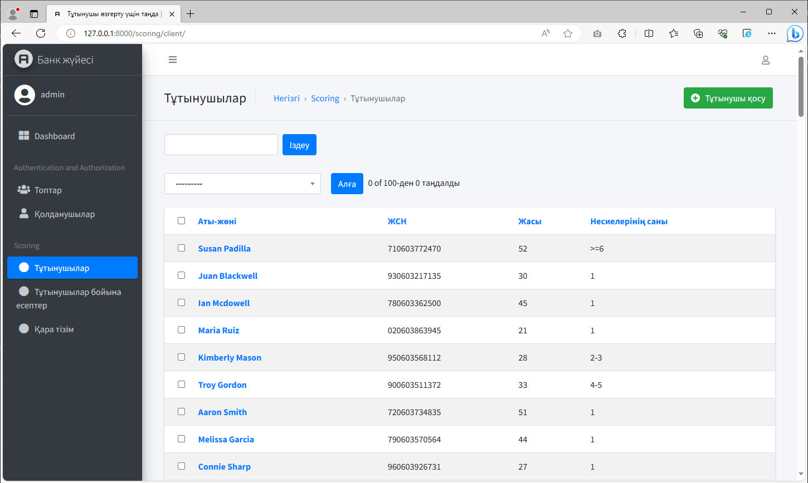
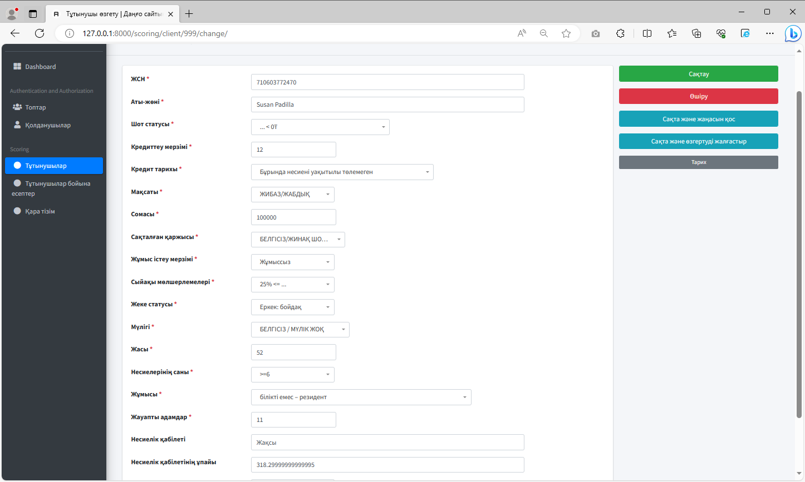
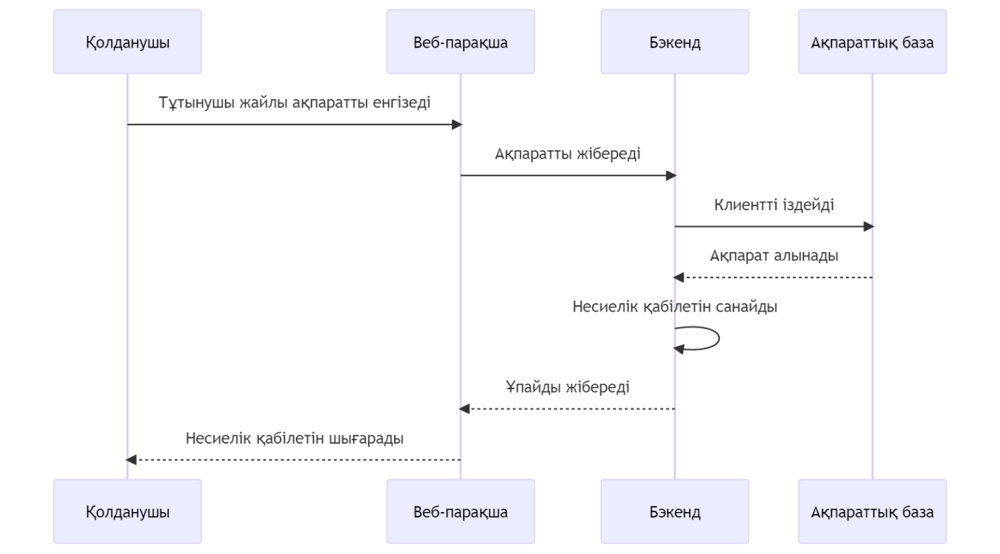

# Скорингке арналған веб-қосымша
Бұл веб-қосымша несие алушының несиелік қабілетін бағаулға арналған. Жүйеге жаңа тұтынушыны қосып, барлық факторларын толтырған соң, бағдарлама автоматты түрде машиналық оқыту моделін қолданып скоринг бағалауын жүргізеді.
* Қолданылған тіл: <b>Python 3.7.5</b> 
* Веб-фреймворк: <b>Django</b>
* Машиналық оқыту кітапханасы: <b>Scikit-learn</b>
* Дизайн: <b>Jazzmin-Django</b>

## Скриншоттар




## Орнату
> GitHub-қа тіркеліп осы жобадағы <b>⭐Star</b> түйіршігін басыңыз (қалауыңызбен)

[Python](https://www.python.org/) веб-сайтынан Python бағдарламасын орнатыңыз (бұл жүйеге ең қолайлы - 3.7.5 версиясы).

Озіңізге ұнайтын Python бағдарламалау ортасын орнатыңыз, мысалға [Pycharm](https://www.jetbrains.com/ru-ru/pycharm/).

Жобаны жүктеп алып, архивтен шығарып оны кез келген ыңғайлы жерге орналастырыңыз. 

Сосын <b>Командная строка</b>-ны ашып мына командаларды енгізіңіз (жобаның орынын озіңіздін жобаны орналастырған жерімен ауыстырыңыз)

```
cd C:\Users\JZX100\Proj3cts\scoring-app_kz
python -m venv env
env\Scripts\activate
pip install -r requirements.txt
```
Веб-қосымшаны қосу үшін:
```
python manage.py runserver
```
Веб-қосымша қосылған соң жүйеге осы адрес бойынша кіресіз: http://127.0.0.1:8000/

* Логин: admin
* Құпиясөз: Qqwerty1!


## Бұл жүйе қалай жұмыс істейді?



1. Біріншіден біз Django веб-фреймворкын қолдана отырып веб-қосымша жасадық. Django фреймворкы MVC (Model-View-Controller(осы жайлы оқып көріңіздер)) архитектурасына бағынады, яғни оның ақпараттық базасы, дизайны және жүйемен әрекеттесуге арналған бүкіл функциялары баптауға келеді. Сол үшін ең басында біз жүйеде қандай ақпарат сақталатынын жазамыз. (<i>scoring/models.py</i>)
```
    iin = models.CharField("ЖСН", max_length=100, default ='0')
	name = models.CharField("Аты-жөні",max_length=100, default ='Unknown')
	status = models.CharField("Шот статусы",max_length=100, choices=status_options.items())
	duration = models.IntegerField("Кредиттеу мерзімі")
	credit_history = models.CharField("Кредит тарихы", max_length=100, choices=credit_history_options.items())
	purpose = models.CharField("Мақсаты", max_length=100, choices=purpose_options.items())
	amount = models.IntegerField("Сомасы",)...
``` 
2. Кейін біз тұтынушылардың скоринг ұпайын бағалау үшін машиналық оқыту моделін қолданамыз. Ол интернет желісінен алынған дайын модель, оған бір тұтынушының ақпараттарын салса ол бізге санауларды жүргізіп ұпайды береді. Модель <b>.pkl</b> форматында жүреді, оны қолдану үшін <b>pickle5</b> кітапханасы қолданылады. Ұпайды санау тұтынушы парақшасында Сақтау(Save) батырмасын басқанда іске қосылады. Модель файлдары <i>scoring/files</i> қалтасында сақталған.
```
def save(self, *args, **kwargs): # scoring/models.py файлы

		BASE_DIR = os.path.dirname(os.path.dirname(os.path.abspath(__file__)))

		# Моделде қолданылатын файлдардың сақталған орындары
		file_path = os.path.join(BASE_DIR, 'scoring', 'files', 'transformer.pkl')
		file_path_2 = os.path.join(BASE_DIR, 'scoring', 'files', 'model.pkl')

		with open(file_path, 'rb') as t:
			transformer = pickle.load(t)
``` 
3. Соңында жүйені тексеру үшін ақпараттық базаға тұтынушылар қосылды. Ол ақпараттар <i>dataset.csv</i>, модельмен бірге келген файлынан алынған. Кездейсоқ аттар мен ЖСН нөмірі жасалынып біздің базаға қосылған. Кез келген тұтынушыныға кіріп сақтау батырмасын басқан кезде, немесе жаңа тұтынушыныны қосқан кезде жүйе автоматты түрде скоринг ұпайын санап базаға жазып қояды.
4. Одан басқа <b>Қара тізім</b> және <b>Есептер (Отчет)</b> парақшалары жасалған. Ол жерде белгілі бір тұтынушыға байланысты ақпарат қосып немесе қара тізімге жазып қоюға болады.

## Байланыс
* Егер сізде осы жоба жайлы сұрақтар туындаса <b>Issues</b> парақшасында сұраныс қалдырсаңыз болады. 
* Менімен осы сілтеме бойынша Telegram желісінде байланысуға болады - [@JZX_I00](https://t.me/JZX_I00). 
